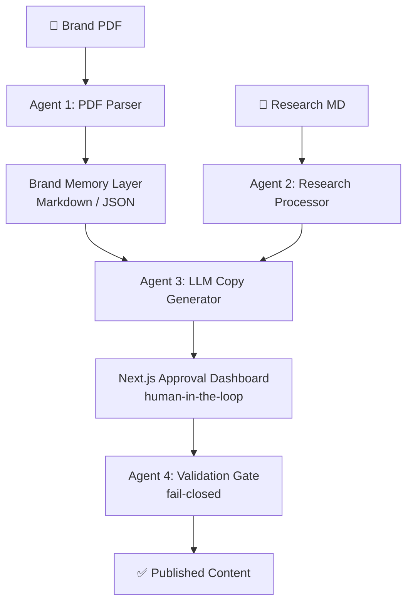

# 🔧 OpenClaw — Multi-Agent LLM Content Pipeline

> Built for BAINSA (Bocconi Association in Artificial Intelligence and Neuroscience)

## What it does
The project is a 4-agent, 5-stage automated content pipeline that takes a brand PDF 
and a research brief and outputs fully compliant, brand-accurate content — 
with zero manual copywriting.

**Result: cut content production from ~40 min to ~3 min per piece (~92% reduction)**

---

## Pipeline Architecture

---

## Tech Stack
| Layer | Tools |
|---|---|
| Agents | Python · LLM APIs · structured prompts |
| Memory | Markdown/JSON brand memory layer |
| Frontend | Next.js · TypeScript |
| Validation | Fail-closed logic · JSON schema enforcement |

---

## My Role
**AI Engineer** — designed and built the agent pipeline, 
brand-memory layer, validation gate

Full team repo: [github.com/mcadario/BAINSA-Social-Media-Manager](https://github.com/mcadario/BAINSA-Social-Media-Manager)

